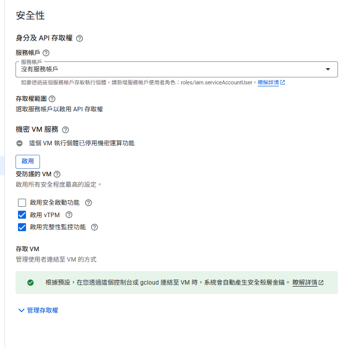

# GCP Compute Engine 初始設定紀錄

## 永久磁碟配置
- 選擇 **標準永久磁碟（Standard Persistent Disk）** 並設定 **20 GB** 作為 VM 系統碟。
- 容量評估依據主要元件需求：
  - Docker 引擎：約 300 MB
  - 基底映像：Ubuntu 約 70 MB、Python 基底約 150 MB
  - Odoo 18 映像：約 2 GB
  - PostgreSQL 映像：約 400 MB
- 20 GB 足夠容納基礎映像與日常快照，後續若有資料成長需求再透過 GCP 擴容。

## 備份策略
- 保留 GCP 預設的 **快照排程**，目前環境僅作為測試與開發節點，暫無額外備援需求。
- 待進入正式營運後，再評估是否增設排程頻率或異地備援策略。

## 安全性設定
- 不建立額外的服務帳戶，其餘 IAM 與安全設定維持預設值。
- 理由同備份策略：此節點僅供 PoC 與開發使用，後續進入生產階段再進行權限最小化與審計規畫。

## 進階功能
- 所有進階功能維持預設（未開啟特別加值服務）。
- 待針對特定需求（如 GPU、Shielded VM、自訂啟動指令）時再另行評估。

## Terraform 等效設定
- 等效 Terraform 範例位於 ./same-terraform.tf，僅供參考或重新命名使用。
