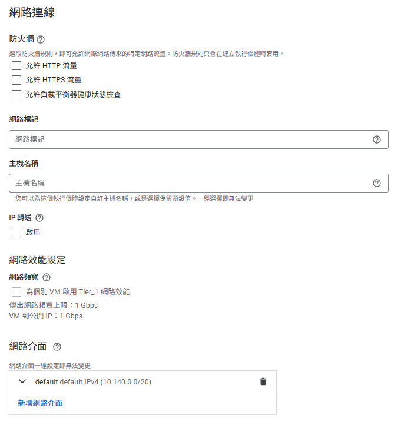
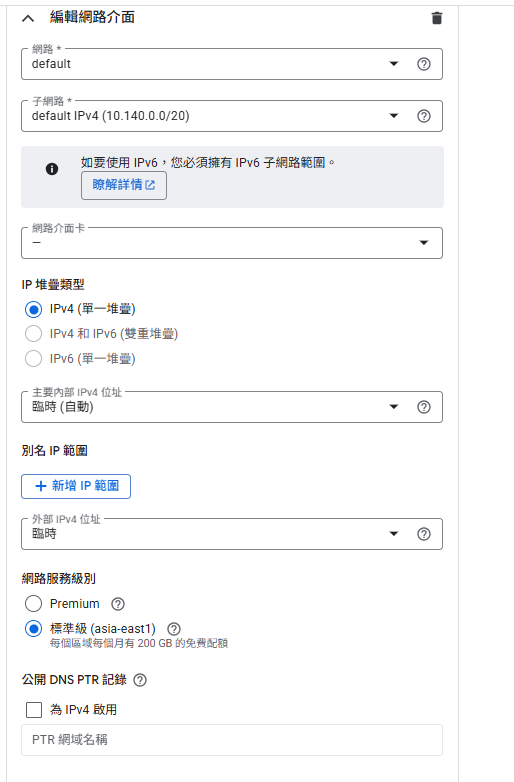

# GCP Compute Engine 網路介面設定說明

## 圖片索引
- 圖一：../images/network/network-interface-main.png — 建立虛擬機時的主要網路介面選項。
- 圖二：../images/network/network-interface-edit.png — 編輯網路介面時可調整的進階欄位，包含 IP 類型與服務級別。

## 底層技術概念

### 網卡（Network Interface Card, NIC）
網卡是虛擬機與外部網路溝通的實際端點，分為實體與虛擬兩種形態。實體網卡通常透過網路線或 Wi-Fi 連接交換器；在 GCP 中，我們設定的是虛擬網卡，決定這張卡被接到哪個 VPC 與子網路。單一 Compute Engine VM 可以掛載多張網卡，以同時進入不同區段或開啟多條流量管道。

### 子網路（Subnet）
子網路是 VPC 內部的區域切分方式，類似大樓中的不同樓層或部門。藉由設定 CIDR 網段，可以將服務依功能或安全需求分區。GCP 的 VPC 負責跨區域的虛擬交換骨幹，而子網路負責在特定區域（Region）內分配 IP。

### IPv4 與 IPv6
IPv4 以 32 位元位址表示，提供約 42 億個地址，是現今網路仍使用的基礎標準。IPv6 則使用 128 位元位址，提供極大量的可用位址並內建自動設定、分層路由與安全性強化。GCP 的網路介面可選擇僅使用 IPv4、或同時指派 IPv6，視服務需求決定。

### 靜態 IP 與 DHCP（Ephemeral IP）
預設情況下，GCP 會透過 DHCP 為 VM 指派臨時 IP（Ephemeral IP），管理成本低且避免位址衝突，但重新啟動或釋放後 IP 可能改變。若服務需要固定入口（如白名單、DNS 指向），可預留靜態 IP。針對初期測試，維持臨時 IP 即可，之後若遇到對外服務定位問題再行調整。

### 網路服務級別（Network Service Tiers）
- **Premium**：流量優先走 Google 全球骨幹網路，提供較低延遲與穩定性，費用較高。
- **Standard**：流量透過 ISP 公共網路傳輸，成本較低但延遲與路由控制較難預測。測試階段可選用 Standard，正式環境再評估是否升級為 Premium。

### 公開 DNS PTR 紀錄
PTR（Pointer）紀錄為反向 DNS 對應，用來從 IP 查詢對應的主機名稱。常見用途包含郵件伺服器驗證、網路安全稽核或記錄追蹤。若服務沒有特別需要公開主機名稱，可暫不設定。

### 別名 IP 範圍（Alias IP Range）
Alias IP 讓單一網卡可持有額外的 IP 範圍，常用於在 VM 上執行容器或多服務時將不同位址指向不同應用。若目前沒有多租戶或容器網路需求，可維持預設不設定。

### 網路卡型態：VirtIO 與 gVNIC
- VirtIO：預設的虛擬化網卡，兼容性高，適合一般工作負載。
- gVNIC：Google 自行開發的高效能網卡介面，可支援更高吞吐量與較低 CPU 使用率，適用於需要高速網路的工作負載。目前若無極端效能需求，使用預設 VirtIO 即可。

### IP 轉送（IP Forwarding）
啟用 IP 轉送後，VM 可轉遞並非發往自身的封包，適用於自建路由器、NAT Gateway 或防火牆等網路設備角色。若 VM 僅執行一般應用伺服器，應維持關閉以降低安全風險。

## GCP 設定重點
1. 於 **網路介面** 面板選擇目標 VPC 與子網路，確保 VM 置於正確區域網段。
2. 決定是否需要 **靜態外部 IP**；若僅供內部測試，可保持臨時 IP。
3. 視需求調整 **IP 類型**（IPv4 / IPv6），並留意防火牆規則同步更新。
4. 若未使用容器或多服務網路，**別名 IP 範圍**、**IP 轉送** 可維持預設關閉。
5. 測試環境建議使用 **Standard** 網路服務級別，後續再評估升級。

