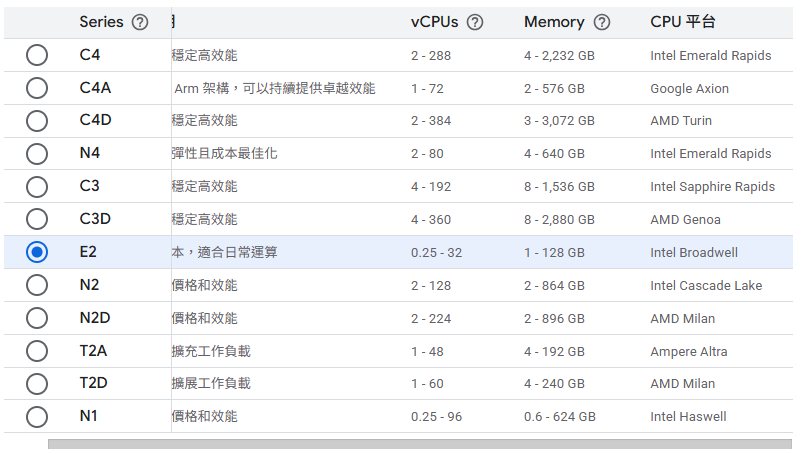

# Odoo 機器挑選邏輯

## 參考經驗法則
- 來源：[Cloudpepper - Odoo Server Sizing Guide](https://cloudpepper.io/docs/monitoring-troubleshooting/odoo-server-sizing/)
- 根據經驗法則，每 6 位同時使用者約需 1 個 worker，且 Odoo 至少需要 2 個 worker 以確保 PDF 生成功能正常。
- 需要的 CPU 核心數約為 worker 數量除以 2 後向上取整。
- 記憶體估算為每個 worker 約 0.5 GB，再加上 1-2 GB 供作業系統與 PostgreSQL 使用；若負載較重，建議每個 worker 預留 1-2 GB。
- 快速參考表顯示 1-6 名同時使用者的配置下，建議 2 個 worker、1 核心與 1-2 GB RAM 起跳。

## 現況評估（5 人內部測試環境）
- 同時上線人數：預估最多 5 人。依規則 5 ÷ 6 ≈ 0.8，仍須維持最小 2 個 worker。
- 建議 worker：2 個（符合最小門檻，後續可視模組複雜度或背景工作量調整）。
- 估算 CPU 核心：2 ÷ 2 = 1 → 至少 1 個 vCPU；若遇到大量排程、報表或自訂模組，建議保留升級到 2 vCPU 的彈性。
- 估算記憶體：0.5 GB × 2 worker + 1-2 GB 系統緩衝 ≈ 2-3 GB；目前配置 2 GB 為最低可行值，若觀察到快取壓力或 PostgreSQL buffer hit 下降，再升至 3-4 GB。

## 後續建議
- 持續監控 CPU load、平均響應時間與 worker queue depth，作為是否擴充核心數或 worker 的依據。
- 測試階段可先使用 e2-small（1 vCPU/2 GB）或同級機型，保留往上擴充至 e2-medium（2 vCPU/4 GB）的規畫。
- 若後續啟用報表自動化、外部整合或高頻背景任務，請預先評估將 worker 與核心同步加倍，以避免佇列阻塞。

## 機型評估參考截圖
- 機型系列選擇示意：../images/compute/machine-series-selection.png
- e2-small 設定細節：../images/compute/machine-type-e2-small.png

